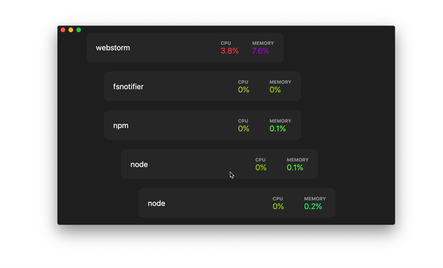

<p align="center"></p>

# Process Explorer

Hierarchical system processes viewer based on web technologies. 

<p align="center"></p>

## Technologies
* Electron
* React
* TypeScript
* Effector
* Ramda

## Install

*macOS 10.10+ is supported (64-bit only).*

**macOS**

[**Download**](https://github.com/lessmess-dev/process-explorer/releases/latest) the `.dmg` file.


---


### Run

```
$ npm install
$ npm start
```

## Sponsored
<a href="https://lessmess.agency/?utm_source=process-explorer">
  
</a>
